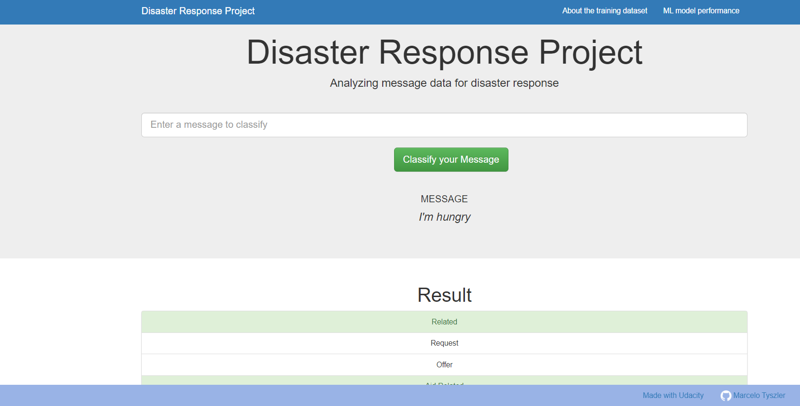
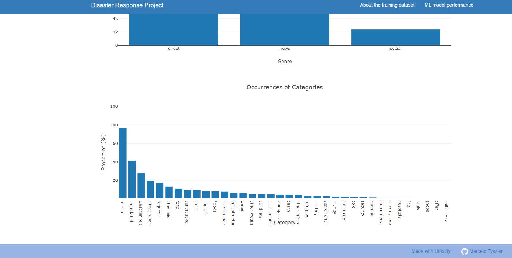
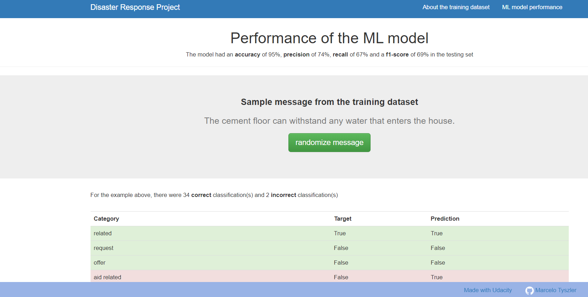

# Disaster-Response-Project
Repository for the course project Disaster Respose as part of the Nanodegree Data Science from Udacity. 

## Project Components
This repository has 3 components:

1. ETL Pipeline (`process_data.py`)
* Loads the messages and categories datasets
* Merges the two datasets
* Cleans the data
* Stores it in a SQLite database

2. ML Pipeline (`train_classifier.py`)

* Loads data from the SQLite database
* Splits the dataset into training and test sets
* Builds a text processing and machine learning pipeline
* Trains and tunes a model using GridSearchCV
* Outputs results on the test set
* Exports the final model as a pickle file

3. Flask Web App (`app` folder)

* Provides basic descriptives of the training data
* Has a form to classifify new messages using the best ML model

## Usage:
In the project's root directory:

* To run ETL pipeline that cleans data and stores in database:

`python data/process_data.py data/disaster_messages.csv data/disaster_categories.csv data/DisasterResponse.db`

* To run ML pipeline that trains classifier and saves:

`python models/train_classifier.py data/DisasterResponse.db models/classifier.pkl`

* To run the web app locally:

`python app/run.py` then go to http://0.0.0.0:3001/ or localhost:3001

* Alternatevely, in unix system type:
`gunicorn app.run:app -b 0.0.0.0:3001` to run a local gunicorn server

## Web app:

The web app has 3 pages:

### Home (= landing page)

This page has form to type a message. After clicking `classify` the app returns the predicted categories for the message. 

This is the main use of the app.

### About the training set

This page has some basic info and two graphs about the training set.

### ML model performance

This page has some info about the performance of the ML model. It selects a random message from the training set and shows the match between target and prediction.

## Live Demo

A live version of the app can be see at https://disaster-response-livedemo.herokuapp.com/

## Requirements

This projects uses **Python 3.7.9** and was developed in windows 10 system. Python package requirements can be found in [`requirements.txt`](https://github.com/mtyszler/Disaster-Response-Project/blob/main/requirements.txt).

Because the project is deployed at Heroku, which uses **Python 3.6.12** package `traitlets` has been set to version `4.3.3` which is the latest version complaint with **Python 3.6**

## Credits and acknowledgments

Thanks to [Udacity](https://www.udacity.com/) for providing the skeleton code and [Figure Eight](https://www.figure-eight.com/?ref=Welcome.AI) for providing the training dataset

